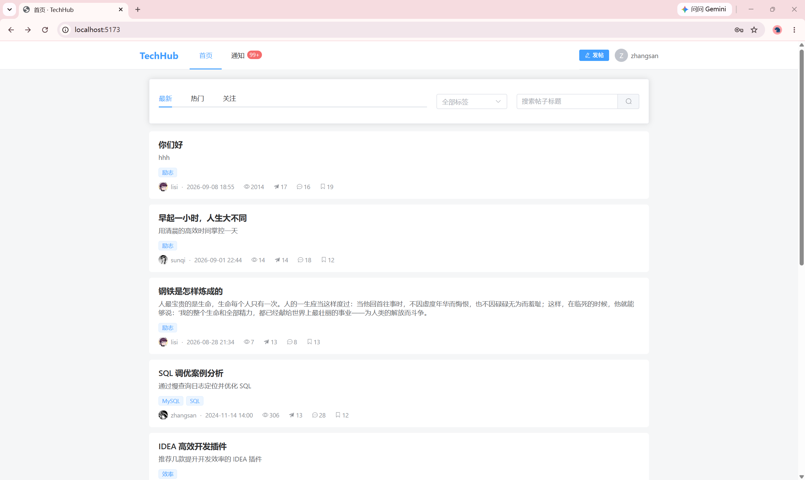

# TechHub 技术社区

一个**技术问答 / 内容社区**全栈项目。后端以 **Spring Boot 3** 为核心,围绕「**高并发 + 缓存 + 分布式**」这条主线,落地了缓存穿透/击穿/雪崩、分布式锁、限流、幂等、MQ 削峰、异步落库等典型场景,并配套 **JMeter 压测**给出优化前后的量化对比。

> 前端仓库为独立的 Vue 3 工程(见「快速开始」),构建产物已内置到 `src/main/resources/front/dist`。

---

## 一、功能一览

- **用户**:注册 / 登录(JWT)、登出、个人资料、头像上传(阿里云 OSS)
- **帖子**:发布(Markdown)、编辑、删除(软删)、详情、列表(最新/热门)、关键词搜索、标签筛选
- **互动**:点赞、评论(多级)、收藏、关注 / 粉丝
- **通知**:点赞 / 评论 / 关注 / 收藏实时通知(MQ 异步),未读数、已读
- **热度榜**:基于 Redis ZSET 的热门帖子排行

---

## 二、技术栈

| 组件 | 版本 | 用途 |
|---|---|---|
| JDK | 17 | 编译目标 |
| Spring Boot | 3.2.5 | 基础框架 |
| MyBatis-Plus | 3.5.7 | ORM / 分页 |
| MySQL | 8.0+ | 数据落库 |
| Redis | 7 | 缓存 / 分布式锁 / 限流 / 幂等 / 热度榜 |
| Redisson | 3.27.2 | 分布式锁(可重入 + 看门狗) |
| RabbitMQ | 3.x | 异步通知、削峰解耦 |
| JJWT | 0.11.5 | JWT 签发 / 校验 |
| 阿里云 OSS | 3.17.4 | 头像对象存储 |
| JMeter | 5.6.3 | 压测 |

---

## 三、系统架构

```
                  ┌──────────────────────────────┐
                  │   Vue 3 + Vite + Element Plus │
                  └───────────────┬──────────────┘
                                  │ HTTP (Authorization: Bearer JWT)
                                  ▼
┌─────────────────────────────────────────────────────────────┐
│                  Spring Boot 3 后端 (8080)                   │
│                                                             │
│   JwtTokenInterceptor 鉴权 → Controller                     │
│   AOP 切面: @RateLimit(限流)  @Idempotent(幂等)              │
│                                                             │
│   Service 业务层                                             │
│    ├─ 帖子 / 评论 / 点赞 / 收藏 / 关注 / 通知 / 标签           │
│    ├─ 热度榜(Redis ZSET)  浏览量(Redis 计数 → 异步落库)      │
│    └─ 帖子详情缓存: cache-aside + 穿透/击穿/雪崩             │
│          击穿锁: Redisson RLock(可重入 + 看门狗续期)         │
│                                                             │
│   Mapper(MyBatis-Plus)                                      │
└───────┬──────────────────────┬──────────────────────┬───────┘
        │ SQL                  │ 缓存/锁/限流/幂等       │ 发布消息
        ▼                      ▼                      ▼
┌──────────────┐      ┌──────────────────┐    ┌──────────────┐
│   MySQL 8    │      │     Redis 7      │    │  RabbitMQ 3  │
│  9 张表落库   │      │ 缓存/ZSET/Lua/锁  │    │  通知队列     │
└──────────────┘      └──────────────────┘    └──────┬───────┘
                                                      │ 消费(手动 ack)
                                                      ▼
                                    NotificationListener → 落库 t_notification
```

> 点赞/评论/收藏/关注成功后,**业务先落库** → `NotificationProducer` 投递消息到 MQ → `NotificationListener` 异步消费写通知表,与主流程解耦、削峰。

---

## 四、核心亮点(面试主线)

| # | 亮点 | 技术方案 | 解决了什么 | 关键代码 |
|---|---|---|---|---|
| 1 | 缓存穿透 | 空值哨兵(不存在的帖子缓存 `NULL`,短 TTL) | 恶意/大量查询不存在 id 直接打穿到 DB | `PostServiceImpl#cachePost` |
| 2 | 缓存击穿 | **Redisson 分布式锁**(可重入 + 看门狗续期),回源重建串行化 | 热点 key 过期瞬间大量并发打 DB | `RedissonConfig` + `queryWithMutexLock` |
| 3 | 缓存雪崩 | TTL 随机抖动 | 同一批 key 同时过期引发 DB 压力 | `PostServiceImpl#cachePost` |
| 4 | 缓存一致性 | 先更库后删缓存 + **延迟双删** | 并发读写导致缓存被旧值污染 | `PostServiceImpl#evictPostCache` |
| 5 | 分布式锁 | 由手写 SETNX 升级为 Redisson,补齐「可重入 + 锁续期」 | 手写锁不可重入、TTL 到期误释放 | `RedissonConfig` |
| 6 | 限流 | `@RateLimit` + Redis 固定窗口 **Lua 脚本**(原子) | 防刷(点赞 30/min、评论 10/min) | `RateLimitAspect` |
| 7 | 幂等 | `@Idempotent` + SETNX | 重复提交 / 网络重试导致重复写 | `IdempotentAspect` |
| 8 | MQ 削峰 | RabbitMQ 异步通知 + 手动 ack | 通知写入与主业务解耦,削峰 | `NotificationProducer/Listener` |
| 9 | 异步落库 | 浏览量先累加 Redis,定时任务批量回写 DB | 每次浏览写 DB 造成写放大热点 | `ViewCountSyncTask` |
| 10 | 热度榜 | Redis ZSET,score = 加权热度 | 首页热门列表避免每次实时算分 | `HotRankServiceImpl` |
| 11 | 登录态 | JWT + Redis(单点登录,同用户单 token) | 无状态鉴权 + 会话可控 | `JwtTokenUserInterceptor` |
| 12 | 关注流 | 拉模式(实时查关注者帖子) | 写简单、天然一致,规模大可演进推拉结合 | `PostServiceImpl#getFollowFeed` |

---

## 五、数据库设计(9 张表)

`sql/schema.sql` 一键建库建表,全部 `t_` 前缀、InnoDB、utf8mb4:

| 表 | 说明 | 关键点 |
|---|---|---|
| `t_user` | 用户 | username/email/phone 唯一索引 |
| `t_post` | 帖子 | 冗余 view/like/comment/collect 计数 + hot_score;`status` 软删 |
| `t_comment` | 评论 | `parent_id` 支持多级评论,软删 |
| `t_like_record` | 点赞 | `(user_id,target_type,target_id)` 唯一,支持帖子/评论 |
| `t_collect_record` | 收藏 | `(user_id,post_id)` 唯一 |
| `t_follow` | 关注 | `(user_id,followee_id)` 唯一 |
| `t_tag` | 标签 | name 唯一 |
| `t_post_tag` | 帖子-标签 | 复合主键多对多 |
| `t_notification` | 通知 | 内容冗余快照,`is_read` 标记 |

> 计数类字段(点赞/评论/收藏/浏览)采用**冗余 + 异步维护**,读列表/详情时避免 `COUNT` 实时聚合。

---

## 六、API 一览

统一返回体 `Result<T>` = `{ code, message, data }`,`code=200` 成功。鉴权接口需请求头 `Authorization: Bearer <token>`。完整定义见 `openapi.json`。

| 模块 | 接口 |
|---|---|
| 认证 | `POST /api/auth/register` `POST /api/auth/login` `POST /api/auth/logout` |
| 用户 | `GET /api/user/me` `GET /api/user/{id}` `PUT /api/user/me` `GET /api/user/{id}/posts` `GET /api/user/{id}/followers` `GET /api/user/{id}/following` |
| 帖子 | `GET /api/posts` `GET /api/posts/feed` `GET /api/posts/{id}` `POST /api/posts` `PUT /api/posts/{id}` `DELETE /api/posts/{id}` |
| 评论 | `GET /api/posts/{postId}/comments` `POST /api/posts/{postId}/comments` `DELETE /api/comments/{id}` |
| 点赞 | `POST /api/like` `DELETE /api/like` |
| 收藏 | `POST /api/collect` `DELETE /api/collect` |
| 关注 | `POST /api/follow/{userId}` `DELETE /api/follow/{userId}` |
| 通知 | `GET /api/notifications` `GET /api/notifications/unread-count` `PUT /api/notifications/read` |
| 标签 | `GET /api/tags` |
| 上传 | `POST /api/upload/avatar` |

---

## 七、项目结构

```
TechHub
├── pom.xml
├── docker-compose.yml              # 本地一键起 MySQL + Redis
├── sql/
│   ├── schema.sql                  # 建库建表
│   └── cleanup_test_data.sql       # 清理压测脏数据
├── jmeter/                         # 压测脚本 + 说明 + 结果分析
└── src/main
    ├── java/com/techhub
    │   ├── TechHubApplication.java
    │   ├── controller/             # 10 个 Controller(鉴权/用户/帖子/评论/点赞/收藏/关注/通知/标签/上传)
    │   ├── service/ + impl/        # 业务层
    │   ├── mapper/                 # MyBatis-Plus Mapper
    │   ├── entity/                 # 实体(对应 9 张表)
    │   ├── dto/ vo/                # 入参 / 出参
    │   ├── common/                 # Result/ResultCode/常量/统一异常/properties
    │   ├── config/                 # MyBatis-Plus/Redis/Redisson/RabbitMQ/Web 配置
    │   ├── interceptor/            # JWT 鉴权拦截器
    │   ├── aspect/                 # 限流 + 幂等切面
    │   ├── annotation/             # @RateLimit / @Idempotent
    │   ├── mq/                     # 通知消息 / 生产者 / 消费者
    │   ├── task/                   # 热度分、浏览量定时任务
    │   └── utils/ context/ enumsort/
    └── resources
        ├── application.yml         # 通用配置(端口/JWT/MyBatis-Plus)
        ├── application-dev.yml     # dev 环境(MySQL/Redis/RabbitMQ/OSS)
        └── front/dist/             # 前端构建产物(由后端托管静态资源)
```

---

## 八、快速开始

### 1. 前置依赖

- JDK 17、MySQL 8、Redis 7、RabbitMQ 3(可用 `docker-compose.yml` 一键起 MySQL/Redis;RabbitMQ 需自行准备)
- 阿里云 OSS(头像上传,需创建 Bucket 并设公共读)

### 2. 配置环境变量(密钥不入库)

所有敏感信息从**环境变量**注入,`application*.yml` 里只有 `${VAR}` 占位符,仓库无任何明文密钥。需设置:

| 环境变量 | 说明 |
|---|---|
| `DB_PASSWORD` | MySQL 密码 |
| `RABBITMQ_PASSWORD` | RabbitMQ 密码 |
| `JWT_USER_SECRET_KEY` | JWT HS256 签名密钥(建议随机 64 位 hex) |
| `ALIYUN_OSS_ACCESS_KEY_ID` | 阿里云 OSS AccessKey |
| `ALIYUN_OSS_ACCESS_KEY_SECRET` | 阿里云 OSS AccessKey Secret |

- **IDEA**:`Run → Edit Configurations → Environment variables` 粘贴(以 `;` 分隔)。
- **命令行 / Docker**:`export VAR=value` 或部署平台注入。本地可用 `.env` 文件(已 gitignore,`docker-compose` 会自动读取)。

> 任一环境变量缺失,启动会 `Could not resolve placeholder` 直接失败 —— 这是**有意为之**,宁可启动失败也不静默用占位值。

### 3. 初始化数据库

```bash
mysql -uroot -p < sql/schema.sql
# 或 docker compose up -d 首次启动自动执行
```

### 4. 启动后端

IDEA 打开工程 → 配好环境变量 → 右键 `TechHubApplication` → Run(端口 8080)。

### 5. 启动前端

```bash
cd D:/MyJavaProject/Frontend
npm install
npm run dev        
```

---

## 九、压测

`jmeter/` 下包含脚本与报告。优化前后对比(关 SQL 打印 + HikariCP 调 50 后):**错误率 0%、总吞吐 61 QPS、P99 6.1s**;详见 `jmeter/压测对比.md` 与 `jmeter/压测结果分析.md`。

> 平均 RT 偏高(~2s)主要来自 MySQL/Redis/MQ 在远程虚拟机的网络往返,非业务瓶颈。

项目截图     首页 


GitHub 仓库地址
https://github.com/hanzi-cyber/TechHub.git
